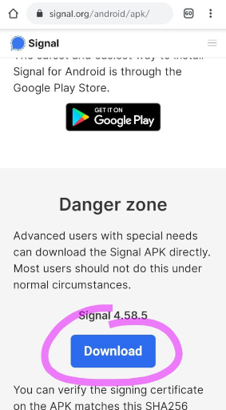

# Device Prep Guide

#### **⚠🛑 Do not share outside of the Co:Vid development team. The content is under review and does not represent official positions of any entity or organization. This site will be updated as the project develops. **

## Overview

Your goal as a Device Prep Volunteer is to take a donated device, wipe, install and test Signal ready for use inside a Hospital.

## Procedure

### Step 1 - Check device is supported
- In the settings, check the device’s Android version. If it’s under 4.4, we cannot use it as it is. So stop here and move on to another device.
- An update may be available for this device but you should only spend time looking for and applying an update if there are no other devices to process.
- If working through a batch, setting up newer models first is more likely to go smoother; older models may require extra steps or Googling.

#### Android: To check your version:
1. From the slide down menu open your settings (gear wheel).
2. Scroll to the bottom to find 'About Phone/Tablet'
3. If Android version is 4.4 or greater, it can be used for this project.
4. If you are able, remove any SIM card and perform a factory reset of the device before donation to clear your information (Usually in settings under Backup & Reset).

#### iPhone / iPad: To check your version:
1. Go to Settings > General > About
2. In the About page, find the Software Version.
3. If it is 10.0 or greater, it can be used for this project.
4. If you are able, remove any SIM card and perform a factory reset of the device before donation to clear your information (Usually in settings under Backup & Reset).

### Step 2 - Charge device
- Ensure the device has significant charge, suggest > 50%, and leave connected for the rest of the process if possible.

### Step 3 - Check for SIM card
- If the device has a removable SIM card, turn off the device and remove it. 
- Even if deactivated, the donor’s personal cell phone number is stored on this and could be viewed by anyone checking the ‘About Phone’ section.

### Step 4 - Factory reset the device
- Skip this step if setting up a brand new out of the box device.
- This is only to remove information left on the device by the previous owner.
- The steps might be different for each device, google “Factory reset” and the device make and model.

### Step 5 - Onboard the device
- Go through the device onboarding steps.
- When prompted, do not enter real names or emails.
- “Patient Phone” is a good name to use.
- Skip any options to sign up for or into google accounts.
- Skip any options to recover data or port from another device.
- You should be prompted to connect to a wifi network as part of this which you must do.
- At the end of this step, you should be on the device's desktop.

### Step 6 - Airplane + WiFi
- In the drag-down menu, turn on Airplane mode to disable bluetooth and cell service.
- Then, re-enable WiFi by tapping the icon. This will extend battery life and reduce background processes on the device.

### Step 7 - Install Signal directly from Signal’s website
- Go to this URL on the device’s web browser. https://signal.org/android/apk/
- Scroll down to the “Danger zone” and click download.
- Open the downloaded file, you will be prevented from installing it, but should be given a button to get quick access to the settings to allow a one time installation of an untrusted app.

### Step 8 - Final steps
- To request new number(s) and prepare your package, follow [These instructions](documents/cvt_final_device_setup.pdf)
- ⚠️Be very careful not to reuse a number, you will end up disabling the first device which may already be in the hospital.
- Once allocated, you are responsible for managing your block of numbers.

### Step 9 - Do a test
- Using a test device, send some messages and do a test video call between it and the newly set up unit.
- During messaging, do not add the devices as contacts to each other, just select the “share profile” option. Delete the conversations afterwards.

### Step 10 - Prepare Care Package
- Either [Download and 3D Print a Stand for Devices (stl model)](assets/cvt_device_holder_model.stl) or source another way to hold and charge the devices.

*Use of this information is subject to these [Terms and Conditions](terms_conditions.md)* 