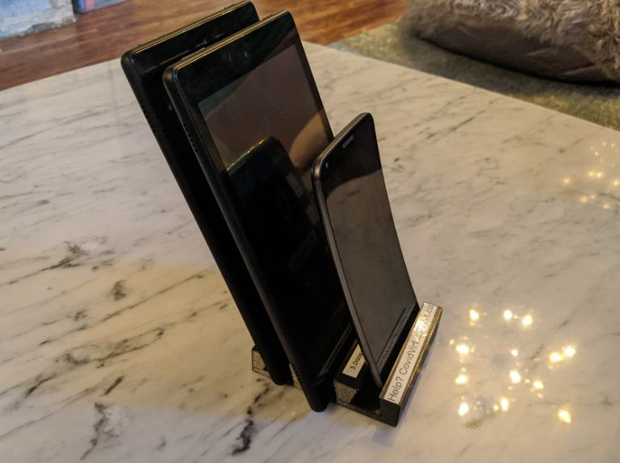

# Community Members

### **⚠🛑 Do not share outside of the Co:Vid development team. The content is under review and does not represent official positions of any entity or organization. This site will be updated as the project develops. **

## Role
Community go-getter who can get things done. 🐱‍🏍♥ Thank you!

## Device Donations

Have that old Android / Apple device laying around? Put it to good use protecting patients and HCWs in their fight against COVID-19!

## Championing
If you are looking at this solution from another area, feel free to start a local effort using the materials found here as a seed packet, and take appropriate steps to approach your local Health Authority with a demonstration packet.

*"My experience so far trying to work with HCWs who are in the middle of a crisis is you can't ask for anything, all you can do is try and bring tools & solutions." - Dr. Brown*

The team is discussing a method of providing feedback to improve these resources. If you are familiar with GitHub, please help [improve this site](https://github.com/co-vid-communication/co-vid-communication.github.io) through Pull Requests or by submitting an [Issue](https://github.com/co-vid-communication/co-vid-communication.github.io/issues)

## Resources
* [How to Help](help_steps.md)
* [Step-by-Step: Prepare Donated Device](device_prep.md)
* [Step-by-Step: Prepare Donated Device: Advanced](device_prep_advanced.md)
* [Download and 3D Print a Stand for Devices (stl model)](assets/cvt_device_holder_model.stl)
* [Requesting Numbers and Final Steps](documents/cvt_final_device_setup.pdf)

