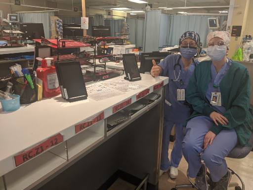

# HealthCare Workers (Technical / Tips) 🩺❤

* ## [Install Signal For HCW (PDF)](documents/cvt_hcw_installation.pdf)
* ## [Install Signal for Patients (PDF)](documents/cvt_patient_quickstart.pdf)
* ## [Uninstall Signal (PDF)](documents/cvt_patient_unregister.pdf)

## Tips from HCWs using this system:
1. Try to set up your stand right where the nurse does their charting. We found that in order for the devices to be used, they had to be in your face at your workstation.
2. If you have more than one three pack, label them front and back with a unique sticker (animals work well) that groups them together.
3. Nurses needed a stand to keep their workstation organized but patients seemed fine using the devices in their hands. In fact putting a stand in the patient room often resulted in the device being plugged in near the wall which prevented the patient from being able to use it from their bed.
4. One charging cord at the workstation was usually enough, since the devices wouldn’t run low at the same time, but it had to be long enough to reach the devices in the stand at the workstation. As soon as devices had to go somewhere else for charging they were easily lost. Every device needed to be either in a patient's hand or back in the workstation stand.

## Championing
If you are looking at this solution from another area / healthcare facility, feel free to start a local effort using the materials found here as a seed packet.
The team is discussing a method of providing feedback to improve methods and information. 

*Use of this information is subject to these [Terms and Conditions](legal.md)* 